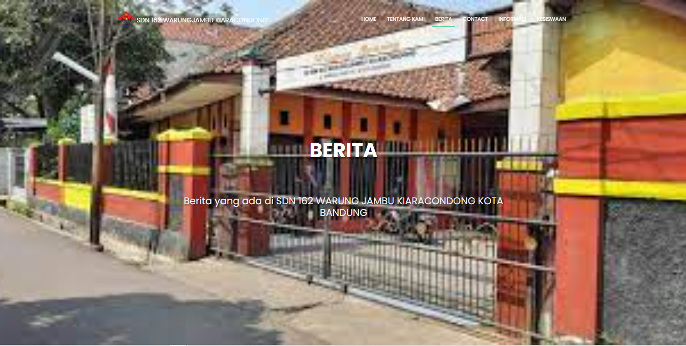
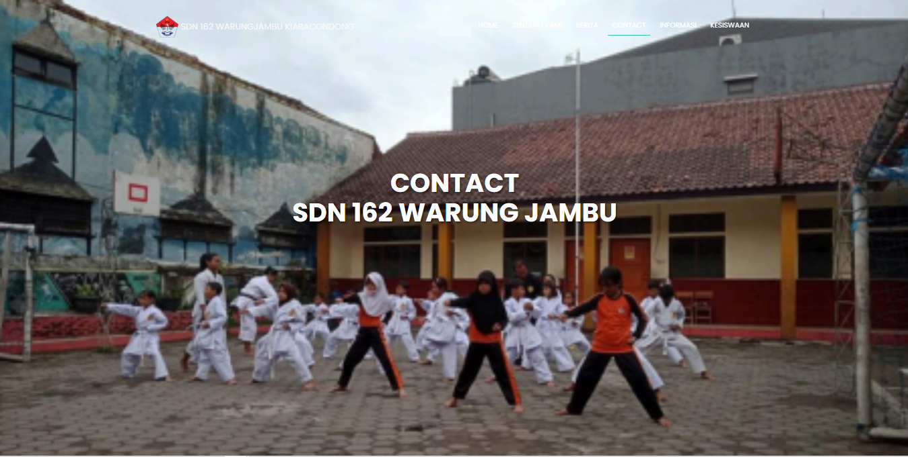
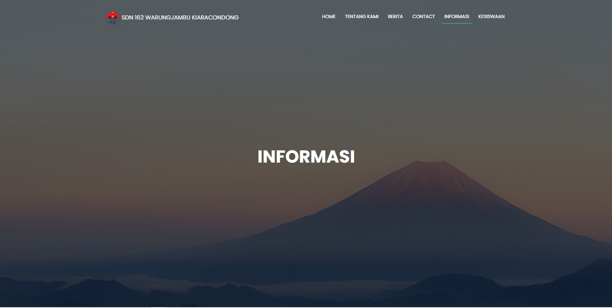
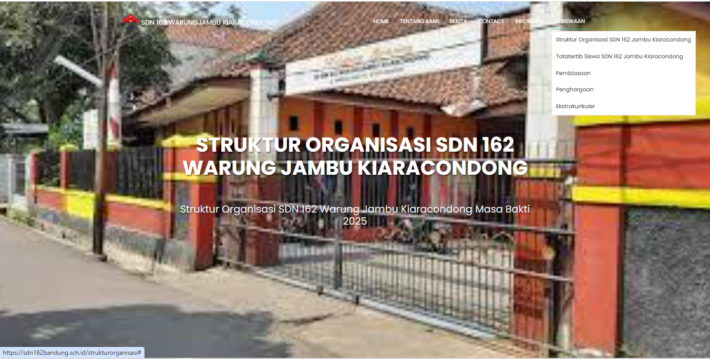
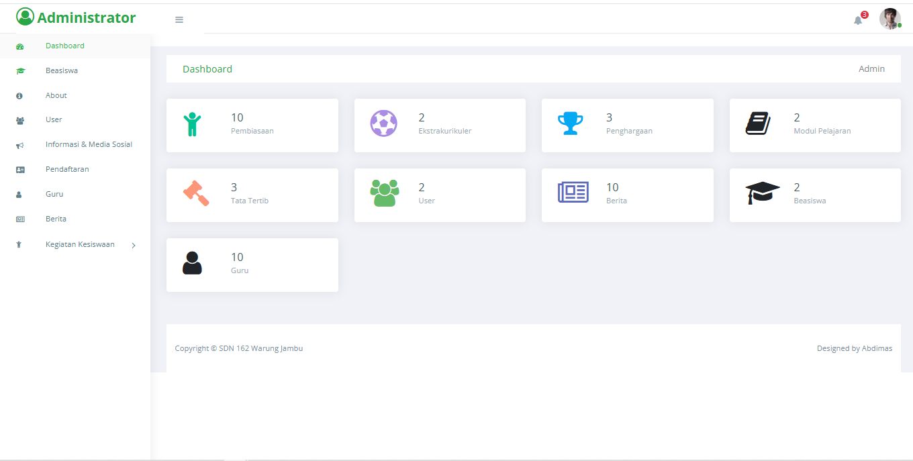
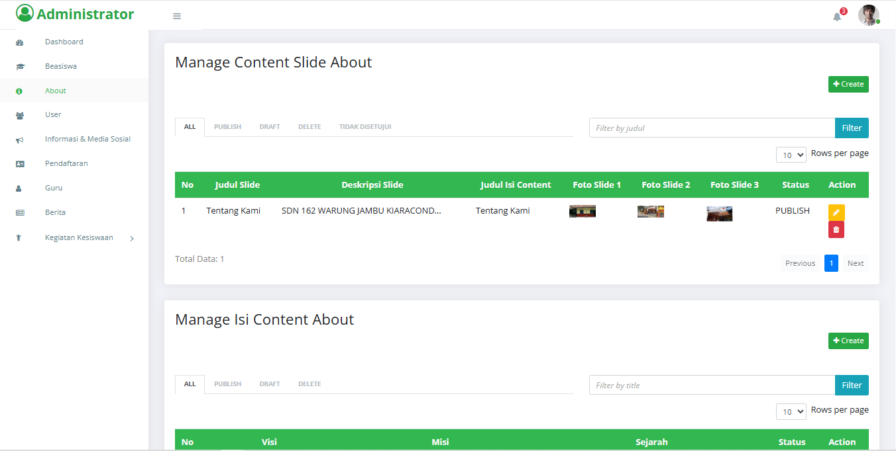

# Website Sekolah SDN 162 Warung Jambu Kiara Condong

Website ini dibuat menggunakan **Laravel Framework** sebagai platform utama.
Tujuan utama dari website ini adalah sebagai **halaman informasi sekolah** sekaligus **sistem manajemen informasi** untuk staff dan guru di SDN 162 Warung Jambu Kiara Condong.

Dengan adanya website ini, sekolah dapat dengan mudah menyampaikan informasi penting, mengelola data guru, siswa, hingga kegiatan kesiswaan.


## ✨ Fitur Utama

### 📊 Dashboard
- Tampilan utama bagi admin, guru, atau staff untuk mengakses ringkasan data dan menu yang tersedia.

### 🎓 Beasiswa
- Informasi mengenai program beasiswa yang tersedia di sekolah.
- Admin dapat menambahkan, mengedit, atau menghapus data beasiswa.

### ℹ️ About (Tentang Sekolah) *(khusus Admin)*
- Mengelola halaman tentang sekolah.
- Memuat profil singkat, visi misi, dan sejarah sekolah.

### 👥 User Management *(khusus Admin)*
- Mengelola akun pengguna (Admin, Guru, Staff).
- Menambahkan, menghapus, atau mengubah hak akses.

### 📢 Informasi & Media Sosial *(khusus Admin)*
- Mengelola informasi umum, pengumuman, dan tautan media sosial resmi sekolah.

### 📝 Pendaftaran *(khusus Admin)*
- Sistem pendaftaran siswa baru.
- Menyimpan data calon siswa secara terstruktur.

### 👩‍🏫 Data Guru *(khusus Admin)*
- Menampilkan dan mengelola data guru yang ada di sekolah.

### 📰 Berita
- Menampilkan berita terbaru terkait sekolah.
- Artikel dapat di-posting oleh admin.

### 🧑‍🤝‍🧑 Kegiatan Kesiswaan
- **Ekstrakurikuler** *(khusus Admin)* → mengelola kegiatan ekstrakurikuler siswa.
- **Tata Tertib** *(khusus Admin)* → mengatur tata tertib sekolah.
- **Penghargaan** → menampilkan prestasi atau penghargaan siswa.
- **Pembiasaan** → menampilkan program pembiasaan harian atau mingguan di sekolah.


## ⚙️ Teknologi yang Digunakan

<div align="center">
  <a href="#">
    
  </a>
  <a href="#">
    
  </a>
  <a href="#">
    
  </a>
  <a href="#">
    
  </a>
  <a href="#">
    
  </a>
</div>


## 🚀 Instalasi & Setup

1. Clone repository ini:
   ```bash
   git clone https://github.com/AhmadArifff/ABIMAS-Website-SDN-162-Warung-Jambu.git
    
    ```

1. Masuk ke folder project:
    
    ```bash
    cd nama-repo
    
    ```
    
2. Install dependencies menggunakan Composer:
    
    ```bash
    composer install
    
    ```
    
3. Copy file `.env.example` menjadi `.env`:
   - Untuk Linux/MacOS:
     ```bash
     cp .env.example .env
     ```
   - Untuk Windows:
     ```bash
     copy .env.example .env
     ```
    
4. Atur konfigurasi database di file `.env`
    
    ```
    DB_DATABASE=sekolah_db
    DB_USERNAME=root
    DB_PASSWORD=
    
    ```
    
5. Generate application key:
    
    ```bash
    php artisan key:generate
    
    ```
    
6. Migrasi dan seed database:
    
    ```bash
    php artisan migrate --seed
    
    ```
    
7. Jalankan server lokal:
    
    ```bash
    php artisan serve
    
    ```
    

## 👨‍💻 Roles & Hak Akses

- **Admin**
    - Akses penuh (mengelola user, informasi, pendaftaran, guru, ekstrakurikuler, tata tertib, dll).
- **Guru**
    - Membaca berita, informasi, kegiatan kesiswaan, dan data terkait lainnya.
- **Staff**
    - Membantu pengelolaan data tertentu sesuai hak akses.
- **Publik**
    - Dapat melihat halaman informasi, berita, dan profil sekolah.


## Screenshot Halaman User
<p align='Left' valign='top'>
  <span>
		
		
		
	    
	    
	    
	    
	    
	    
	    
	    
	    
	    
  </span>
</p>

<br />
<br />

## Screenshot Halaman Admin
<p align='Left' valign='top'>
    <span>
        
        
        
        
    </span>
</p>


<br />
<br />

